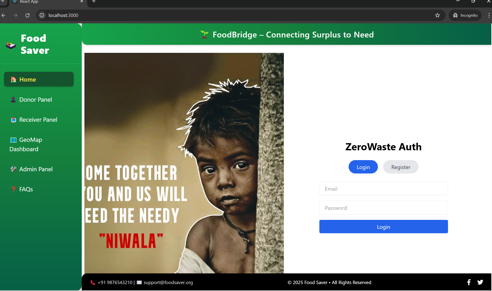
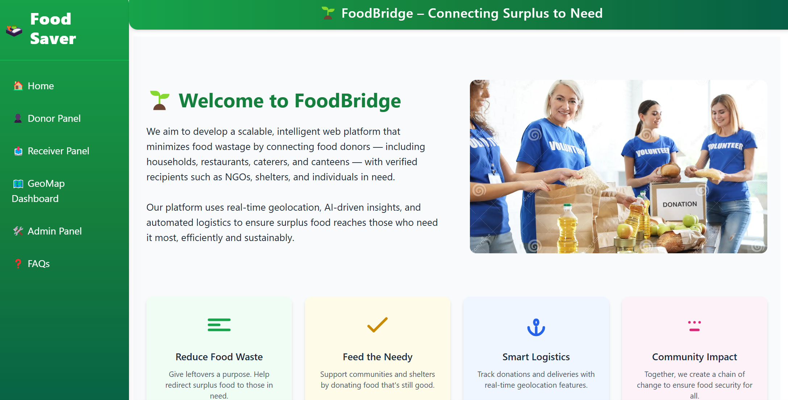
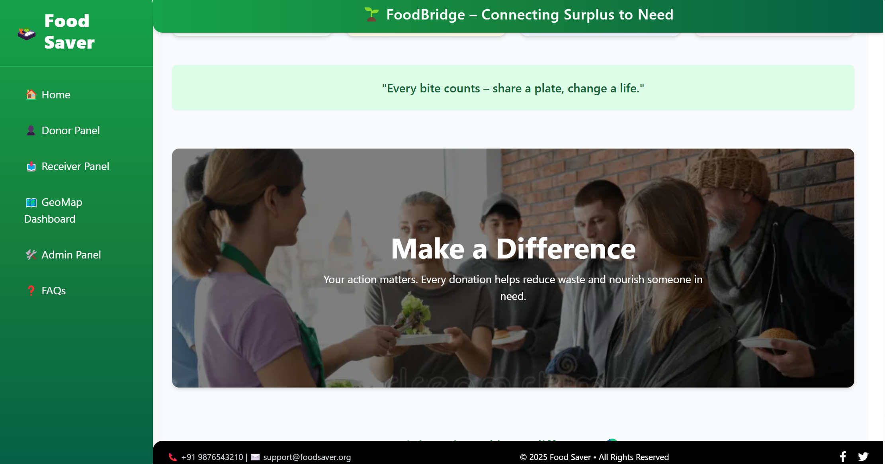
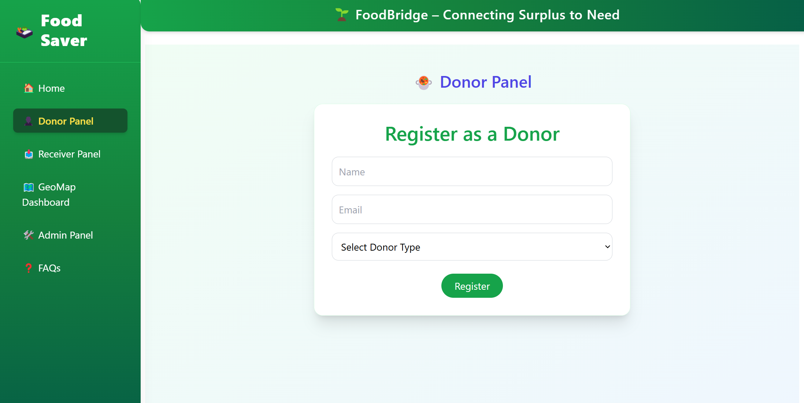
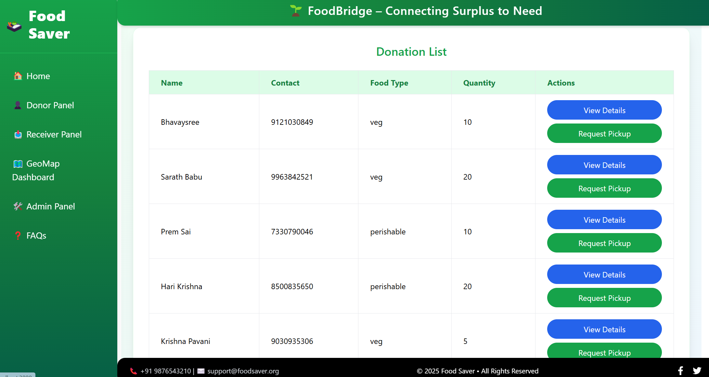
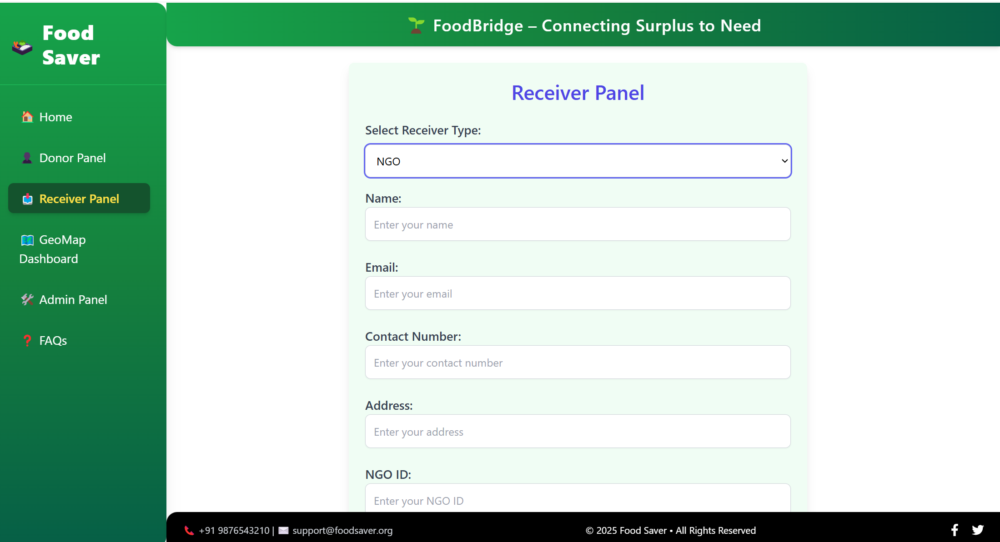
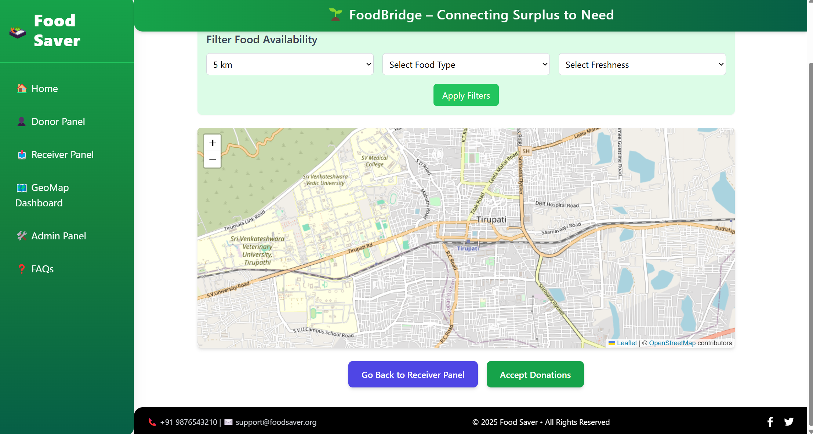
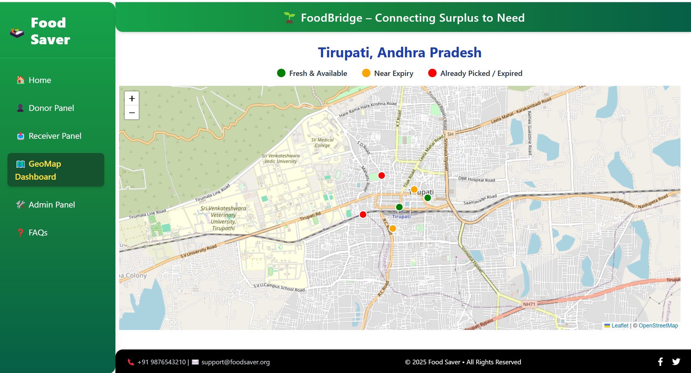
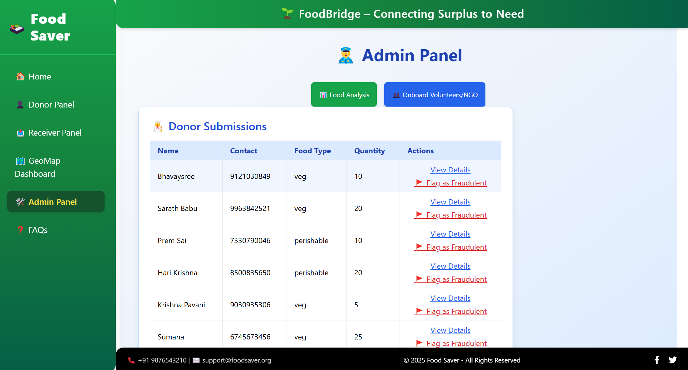
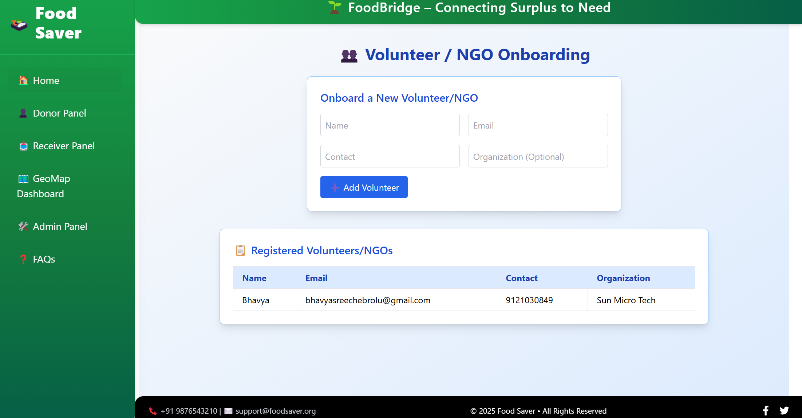

# ZeroWaste – AI Powered Geo-Intelligent Food Donation and Rescue System

## Selected Domain:
**Web Development**

## Problem Statement / Use Case:
**Problem Statement:**  
“ZeroWaste – AI Powered Geo-Intelligent Food Donation & Rescue System”

This project aims to reduce food wastage by creating a platform where food donors (households, restaurants, caterers, and canteens) can easily donate excess food to verified recipients (NGOs, shelters, and individuals in need). The platform uses AI insights and real-time geolocation for optimized food rescue and logistics management.

## Abstract / Problem Description:
**Objective:**  
Develop a scalable, intelligent web platform that minimizes food wastage by connecting food donors with verified recipients using real-time geolocation, AI-driven insights, and automated logistics management.

This platform will facilitate:
**Donor Panel:** Donors can register, post food donations, and track the donation lifecycle.
- **Receiver (NGO) Panel:** Recipients can register, accept donations, and manage food requests.
- **Admin Panel:** Admins can manage all users, monitor donations, and oversee platform operations.
- **Geo-Intelligent Insights:** The platform uses real-time geolocation to match donors and recipients effectively based on proximity.

### Key Features:
- **Food Donation Posting:** Donors can easily post available food with details such as quantity and expiration.
- **Real-Time Tracking:** AI insights for food donation status and delivery tracking.
- **Automated Logistics:** A seamless process for food collection and delivery.

## Tech Stack Used:
- **Frontend:** React.js
- **Backend:** Node.js, Express
- **Database:** FireBase
- **Geolocation:** OpenStreetMap using Leaflet
## AI Model:
This project leverages the **UARI** (User Attention Recognition Interface) model for food quantity estimation based on images uploaded by donors. The AI model utilizes machine learning algorithms to process and analyze food images and optimize the donation process. It also helps in matching donors with recipients efficiently based on real-time needs.

## Note for Accessing the Application

To view the homepage of the application on the deployed Vercel link, please follow these steps:

1. **Vercel Link:** [ZeroWaste – AI Powered Food Donation Platform](https://zero-waste-swart.vercel.app)

2. **Login Credentials:**  
   - **Email:** bhavyasreechebrolu@gmail.com  
   - **Password:** 72117211  

   These credentials are for Firebase authentication to access the platform.

## Project Explanation:
This project is designed to help reduce food wastage by connecting donors with verified recipients through an AI-powered, geo-intelligent system. The web platform features user-friendly interfaces for donors and NGOs to register, post donations, and track the lifecycle of donations. The AI-powered system ensures optimized logistics and efficient food rescue based on real-time data.

### Screenshots:

